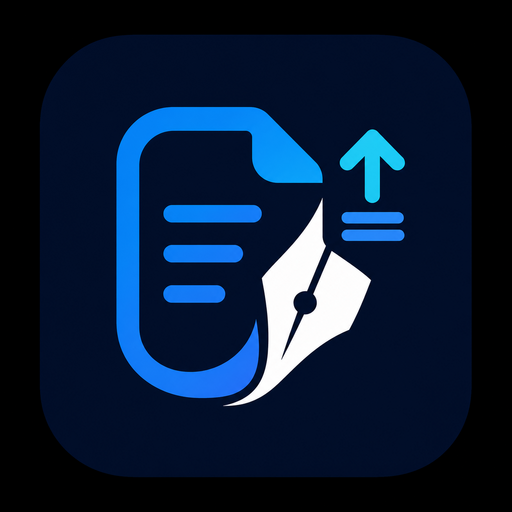

<p align="center">
  
</p>

# N2N Post2Site

AI-assisted content publishing MCP server for blogs and product guides.

[](https://www.npmjs.com/package/n2n-post2site)
[](https://www.npmjs.com/package/n2n-post2site)
[](https://github.com/n2ns/n2n-post2site/blob/main/LICENSE)
[](https://modelcontextprotocol.io)
[](https://nodejs.org)
[](https://datafrog.io)

N2N Post2Site lets an AI assistant draft, edit, review, and publish website content through a narrow Content Publishing API Contract. It is built for teams that want AI-assisted blog posts, technical notes, changelogs, and product guides without giving the assistant database access, shell access, deployment access, payment access, or user administration access.

It is intentionally small: a local MCP bridge between your IDE assistant and your website content API. Your website remains responsible for authentication, validation, storage, preview, publishing rules, and audit behavior.

## Quick summary

- Runs locally as an MCP server.
- Connects to one website content API through `CONTENT_API_BASE_URL` and `CONTENT_API_KEY`.
- Creates drafts by default.
- Publishes only through an explicit publish tool.
- Submits one locale per create or update call.
- Uses Markdown-first content, with optional inline HTML when your site supports it.
- Reads product context before drafting product guides.
- Does not expose database, shell, server, payment, user, pricing, or delete operations.

## When to use it

Use N2N Post2Site when you want an AI assistant to help with:

- Company blog posts.
- Product guides.
- Technical field notes.
- Release notes and changelogs.
- Localized article drafts.
- Safe updates to existing website content.

Do not use it as a CMS. It does not provide an admin panel, database schema, storage backend, preview system, deployment workflow, or image upload service.

## Publishing model

N2N Post2Site works with two publishing spaces:

| Space | `content_scope` | Example |
|---|---|---|
| Company blog | omitted or empty | technical notes, announcements, changelogs |
| Product guide | `kind:key` | `product:evisa-helper` |

The backend defines which scopes are valid. A product guide should only be written after the assistant reads controlled product context with `n2n_get_product_context`.

The assistant should follow this workflow:

1. Call `n2n_get_capabilities`.
2. Search existing content with `n2n_list_posts`.
3. For product guides, call `n2n_get_product_context`.
4. Create or update one locale at a time.
5. Review the draft.
6. Publish only through `n2n_publish_post`.

## Requirements

- Node.js 22+
- An MCP-capable client or IDE
- A site-scoped content API token
- A backend that implements the Content Publishing API Contract

## Install

For local development:

```bash
npm install
npm run build
npm run check
```

For MCP clients, use the published package after it is available on npm:

```bash
npx -y n2n-post2site
```

## Configuration

Set these environment variables in your MCP client configuration:

```env
CONTENT_API_BASE_URL=https://example.com/api/v1/mcp
CONTENT_API_KEY=change-me
```

`CONTENT_API_BASE_URL` is the base URL of your protected content API. The backend should expose `/capabilities`, `/products/{content_scope}`, and `/posts` relative to this base URL.

Keep path mapping and field mapping in the backend adapter, not in MCP client configuration. The MCP config should only need a base URL and an API key.

Do not put API keys in prompts, article content, README examples, or screenshots.

## MCP client examples

### Using the npm package

```json
{
  "mcpServers": {
    "n2n-post2site": {
      "command": "npx",
      "args": ["-y", "n2n-post2site"],
      "env": {
        "CONTENT_API_BASE_URL": "https://example.com/api/v1/mcp",
        "CONTENT_API_KEY": "change-me"
      }
    }
  }
}
```

### Using a local checkout

```json
{
  "mcpServers": {
    "n2n-post2site": {
      "command": "node",
      "args": ["/path/to/n2n-post2site/dist/index.js"],
      "env": {
        "CONTENT_API_BASE_URL": "https://example.com/api/v1/mcp",
        "CONTENT_API_KEY": "change-me"
      }
    }
  }
}
```

Bind one MCP server configuration to exactly one website. Do not ask the AI assistant to choose a `site_id` in tool arguments.

## Backend API contract

The backend should support these endpoints relative to `CONTENT_API_BASE_URL`:

```http
GET    /capabilities
GET    /products/{content_scope}
GET    /posts
POST   /posts
GET    /posts/{id_or_slug}
PATCH  /posts/{id_or_slug}
POST   /posts/{id_or_slug}/publish
```

### `GET /capabilities`

Returns the publishing contract for AI clients, including:

- Supported content types.
- Supported statuses.
- Supported locales.
- Single-locale input fields.
- `content_scope` rules.
- Available product guide scopes.
- Safety boundaries.

### `GET /products/{content_scope}`

Returns controlled product context before drafting product guides.

Expected fields:

- `content_scope`: confirms the valid product guide scope.
- `canonical_url`: product page for deeper reading, links, and citations.
- `docs_url`: docs or guide index to prefer for tutorials.
- `summary`: controlled product summary.
- `key_points`: controlled facts the assistant may rely on.
- `do_not_claim`: claims the assistant must not make.

### Create and update payloads

Create and update calls use one locale per request:

```json
{
  "slug": "example-product-guide",
  "type": "guide",
  "content_scope": "product:example-product",
  "locale": "en",
  "title": "How to Use Example Product",
  "excerpt": "A short guide to using the example product.",
  "content": "## Overview\n\nMarkdown content..."
}
```

Rules:

- `title` is plain text.
- `excerpt` is plain text.
- `content` is Markdown.
- Inline HTML is allowed when useful.
- Full HTML documents with `<html>`, `<head>`, or `<body>` are not allowed.
- Create/update must not accept `status`, `published_at`, `user_id`, or `author`.
- Publishing state changes only through `/posts/{id_or_slug}/publish`.

Backends may return `missing_locales` and `next_actions` after create, update, or publish. The assistant should add missing language versions with additional `n2n_update_post` calls instead of asking the backend to auto-translate.

## MCP tools

### `n2n_get_capabilities`

Read backend capabilities before creating or updating content.

```json
{}
```

### `n2n_list_posts`

Search existing posts before drafting new content.

```json
{
  "status": "draft",
  "type": "guide",
  "content_scope": "product:example-product",
  "q": "setup guide",
  "per_page": 20
}
```

`status` is only a filter here. Do not send `status` in create or update calls.

### `n2n_get_post`

Read an existing post before updating it, completing missing locales, or writing a follow-up.

```json
{
  "id_or_slug": "example-product-guide"
}
```

### `n2n_get_product_context`

Read controlled product facts before drafting a product guide.

```json
{
  "content_scope": "product:example-product"
}
```

### `n2n_create_post`

Create a draft. Publishing is separate.

Company blog example:

```json
{
  "slug": "content-workflow-notes",
  "type": "technical",
  "locale": "en",
  "title": "Content Workflow Notes",
  "excerpt": "Practical notes from shipping a content workflow.",
  "content": "## Notes\n\nMarkdown content..."
}
```

Product guide example:

```json
{
  "slug": "example-product-guide",
  "type": "guide",
  "content_scope": "product:example-product",
  "locale": "en",
  "title": "How to Use Example Product",
  "excerpt": "A short guide to using the example product.",
  "content": "## Overview\n\nMarkdown content..."
}
```

### `n2n_update_post`

Update one locale of an existing post. Call `n2n_get_post` first.

```json
{
  "id_or_slug": "example-product-guide",
  "locale": "de",
  "title": "So verwenden Sie Example Product",
  "excerpt": "A localized summary for the selected locale.",
  "content": "## Ueberblick\n\nLocalized Markdown content..."
}
```

### `n2n_publish_post`

Publish an existing draft.

```json
{
  "id_or_slug": "example-product-guide"
}
```

## Content format

- Submit one locale per create or update call.
- Use Markdown for `content`.
- Use fenced code blocks for commands, JSON, YAML, and code examples.
- Use Markdown image syntax for images.
- Always include descriptive image alt text.
- Reference public image URLs or existing site paths.
- This MCP does not upload images in v1.

Image example:

```md

```

## Safety boundaries

N2N Post2Site should not expose:

- Delete operations.
- Product configuration writes.
- Pricing plan writes.
- User administration.
- Payment or subscription administration.
- Database queries.
- Log access.
- Shell commands.
- Deployment or server operations.

Recommended backend behavior:

- Sanitize backend errors before returning them to the AI client.
- Use a site-scoped API key with the minimum permissions needed.
- Create drafts by default.
- Keep create/update and publish separate.
- Set `published_at` on the backend, not from MCP input.

## Laravel backend package direction

A Laravel package can implement the HTTP side of this contract for multiple Laravel sites without copying controllers between projects. N2N Post2Site should stay a generic MCP client of that contract.

## About N2NS Lab

Built by N2NS Lab, Datafrog's open-source lab for AI-native developer tools.

Learn more: https://n2ns.com

Source repository: git@github.com:n2ns/n2n-post2site.git
